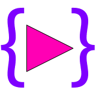

<p align="center">
    
    <h1 align="center">Scriptable Animator Controller</h1>
    <p align="center">
        <a href="https://assetstore.unity.com/packages/tools/animation/scriptable-animator-controller-240117" target="_blank"></a>
    </p>
</p>

# ❓ What is the Scriptable Animator Controller?
This asset was created as an alternative to the mecanim animation system. When programming with Mecanim, the transition lines become more complex as the number of states increases. The Scriptable Animator Controller provides simple and effective control of state transitions with lines of code.

# 📦 Getting Started
In order to use the example, the “StarterAssets” projects must be imported. Then, the scene named “Playground” should be opened from the “StarterAssets/Demos/ScriptableAnimator/Scenes” file path.

#### 📌 Inheritance: 
The class that will be the controller must inherit from the 'AnimatorBehavior' class. After inheritance, the methods needed to manage animations can be used.

#### 📌 Initialize: 
The 'Initialize' function should be run first in the 'Awake' method. Otherwise, the controller will not initialize and cause an error.

#### 📌 Set Animation: 
It can be set via the Inspector or in lines of code. If you want to set it in the code line, it must be set before creating the layer. Animation can be set with the 'SetAnimation' method in the State.

#### 📌 Entry: 
'PerformTransition' can be used instead. It's just a shorter method and runs on entry.

#### 📌 Playing & Transitions: 
For this, functions inherited from 'AnimatorBehaviour' can be used. Other methods needed in animation management can be accessed using this namespace: ‘Plugins.ScriptableAnimator.Extensions’ 
State can be transitioned using the 'PerformTransition' function. If the animations need to be changed, the state must be updated with the 'UpdateState' function. The processing cost of the 'UpdateState' function increases as the count of animations increases.

# 📦 States
 ‘Plugins.ScriptableAnimator.States’
These are the classes that contain the playables. The state used can be single or mixed. The choice should be made according to whichever is needed.

#### 📌 SingleAnimation:
A single clip is played. It does not take a Threshold value.

#### 📌 BlendTree1:
The mix clip is played and gets a threshold value of type 'float'. The weights of the clips played are determined according to the threshold value.

#### 📌 BlendTree2:
The mix clip is played and gets a threshold value of type 'Vector2'. The weights of the clips played are determined according to the threshold value.

# 📦 Animation Containers
‘Plugins.ScriptableAnimator.Animations.Containers’
These are containers that hold animations to be played in the state. It is recommended that animation set or update be done with containers. It can be created from the ‘Create/Scriptable Animator’ create menu path.

##### 📌 SingleAnimationSO: 
Contains animation for 'SingleAnimation'.

##### 📌 BlendTree1SO: 
Contains animation for ‘BlendTree1’.

##### 📌 BlendTree2SO: 
Contains animation for ‘BlendTree2’.

## #️⃣ About source code;
99% of codes are readable and changeable.

## ⚙️ How does it work?
<details><summary>Basic Example</summary>

 ```c#
    public sealed class PlayerAnimatorController : AnimatorBehaviour
    {
        [SerializeField] private SingleAnimation m_JumpStartState;
        [SerializeField] private BlendTree1 m_MovementState;
        [SerializeField] private bool jump;
        [SerializeField] private float speed;

        private void Awake()
        {
            Initialize();
            CreateLayer(LayerConfig.Primary, m_JumpStartState, m_MovementState);
            Entry(m_MovementState);
        }
        private void FixedUpdate()
        {
            if (jump)
            {
                m_JumpStartState.PerformTransition(TransitionConfig.ResetTime);
            }
            else
            {
                m_MovementState.SetParameter(speed);
                m_MovementState.PerformTransition(TransitionConfig.Default);
            }
        }
        private void OnEnable() => Play();
        private void OnDisable() => Stop();
        private void OnDestroy() => DestroyController();
    }
```
</details>

<details><summary>Multi Layer Example</summary>

 ```c#
    public sealed class PlayerAnimatorController1 : AnimatorBehaviour
    {
        [SerializeField] private SingleAnimation m_JumpStartState;
        [SerializeField] private BlendTree1 m_MovementState;
        [SerializeField] private SingleAnimation m_DynamicState;
        [SerializeField] private bool secondLayer;
        [SerializeField] private bool jump;
        [SerializeField] private float speed;

        private void Awake()
        {
            Initialize();
            CreateLayer(LayerConfig.Primary, m_JumpStartState, m_MovementState);
            CreateLayer(LayerConfig.Default, m_DynamicState);
            Entry(m_MovementState);
        }
        private void FixedUpdate()
        {
            // Main Layer: Index -> 0
            if (jump)
            {
                m_JumpStartState.PerformTransition(TransitionConfig.ResetTime);
            }
            else
            {
                m_MovementState.SetParameter(speed);
                m_MovementState.PerformTransition(TransitionConfig.Default);
            }

            // Second Layer: Index -> 1
            if (secondLayer)
            {
                SetLayerWeight(1, 1);
                m_DynamicState.PerformTransition(TransitionConfig.Default);
            }
            else
            {
                SetLayerWeight(1, 0);
            }
        }
        private void OnEnable() => Play();
        private void OnDisable() => Stop();
        private void OnDestroy() => DestroyController();
    }
```
</details>
